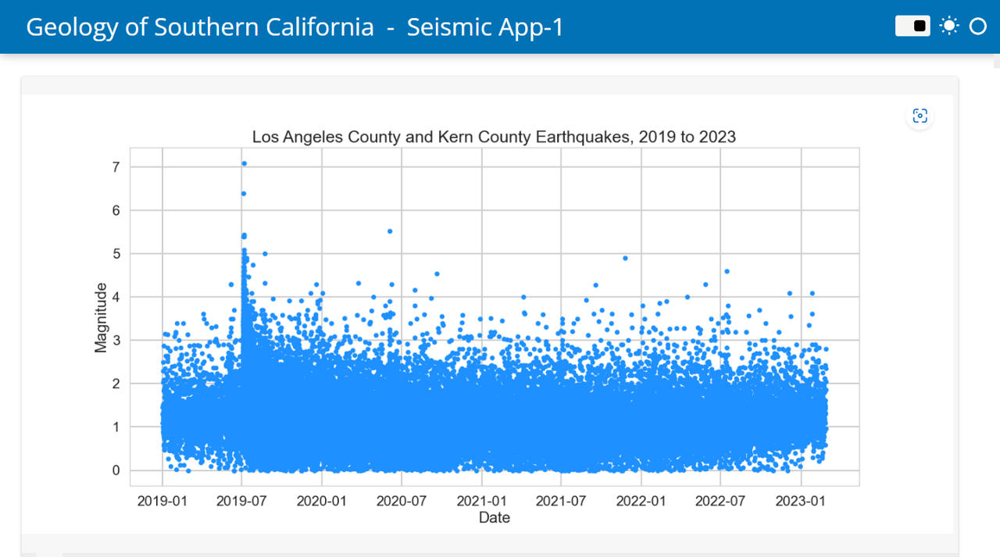
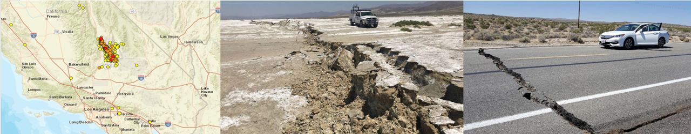
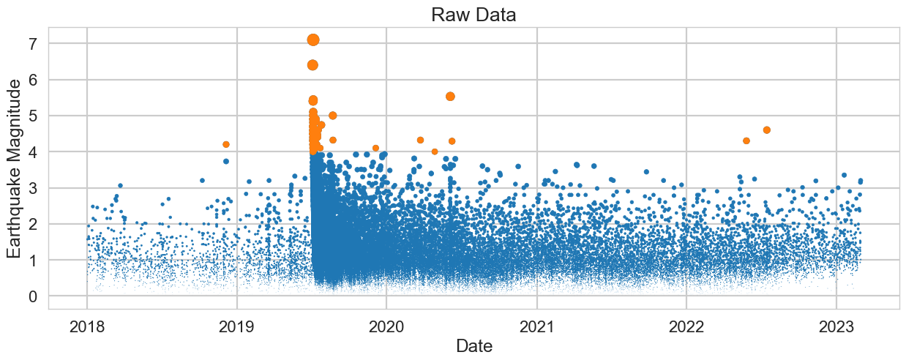
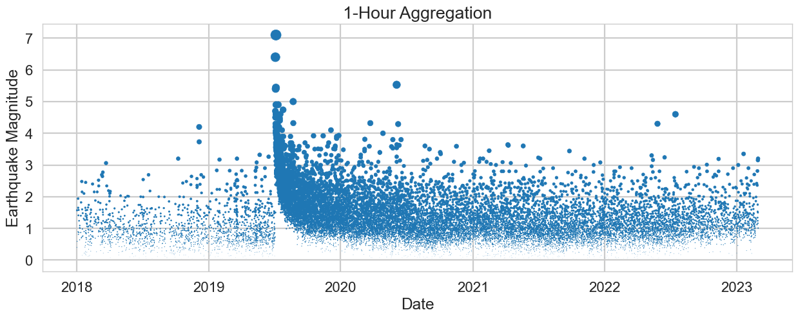
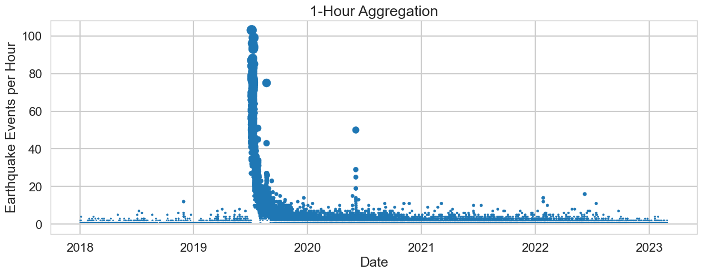

# Earthquake-App-with-ObsPy-and-Panel
A data app for visualizing the magnitudes of earthquake events from 2019 to the present (Feb 2023) in Los Angeles County and Kern County in Southern California.
## Introduction

In this notebook we get near-real-time data on earthquake magnitudes from Los Angeles County and Kern County from 2019 to the present (Feb. 2023). I went back to 2019 to capture the memorable Ridgecrest earthquakes from 2019 (I was eating at my favorite Mexican restaurant when the largest earthquake in the 2019 sequence hit and we jumped under the table and rocked and rolled for a long time in Pasadena, CA, on Colorado street). 

We make a simple time sequence-based visualization of the earthquake magnitude data with MatplotLib and then create a simple data app using HoloViz Panel. The simple data app is in the image below. 

## Ridgecrest 2019 Earthquake Sequence

Notice the spike in large magnitude earthquakes around July 2019. That is the Ridgecrest earthquake sequence, memorable to millions of people in Southern California. 

The Ridgecrest earthquake sequence was a series of earthquakes that occurred in the Ridgecrest area of Southern California in July 2019. The sequence included two major earthquakes, along with a bunch of aftershocks.

-The **first earthquake**, a **magnitude 6.4**, occurred on **July 4, 2019, at 10:33 a.m.** local time. The epicenter was located about 11 miles from the city of Ridgecrest, which has a population of around 29,000 people. The earthquake was felt across Southern California and parts of Nevada, and it caused significant damage in the Ridgecrest area.

The second earthquake, a magnitude 7.1, occurred the following day, on July 5, 2019, at 8:19 p.m. local time. The epicenter was located about 9 miles from Ridgecrest. The earthquake was felt across a large portion of Southern California and parts of Nevada, and it caused even more damage than the first earthquake.

The Ridgecrest earthquake sequence included more than 100,000 aftershocks, a scary event all in all, but some great seismic data to study was definitely generated.

A visualization of all earthquake activity in the Ridgecrest area from 2018 to early March 2023 is given below.

 

## ObsPy Python Library

ObsPy is a Python library used for processing and analyzing seismological data. It provides a powerful and flexible framework for working with seismic data, from raw waveform data to high-level analysis.

ObsPy can read and write a wide variety of seismic data formats, including miniSEED, SAC, and GSE2, among others. It also provides a suite of tools for working with these data, including filtering, instrument correction, and deconvolution. Additionally, ObsPy includes several utilities for common tasks in seismology, such as downloading and preprocessing earthquake data.

An important strength of ObsPy is the ability to integrate with other Python libraries (NumPy, MatplotLib, . . . ) allowing users to perform complex analyses and visualizations with ease.

ObsPy is a great tool for seismological data analysis in Python, give it a try!

### Data Source: The IRIS Seismographic Network

The IRIS (Incorporated Research Institutions for Seismology) Seismographic Network is a global network of seismic stations that monitor earthquakes and other seismic activity around the world. It is operated by the IRIS Consortium, which is made up of over 120 universities and research institutions in the United States and around the world.

The IRIS network includes over 600 seismic stations in the United States and more than 1000 stations in more than 90 other countries. These stations use a variety of instruments, including seismometers, accelerometers, and other sensors, to detect and record seismic waves generated by earthquakes and other seismic events.

The data collected by the IRIS network is used by seismologists and other researchers to study earthquakes, seismic activity, and the structure of the Earth's interior. It is also used to develop earthquake early warning systems and to improve our understanding of earthquake hazards and risks. In addition, the data is made available to the public through the IRIS Data Management Center, where it can be accessed and analyzed by anyone interested in studying earthquakes and seismic activity.

### Next Steps

##### Multi-page App

Serving multiple apps with HoloViz Panel, Marc Skov Madsen,     
https://www.youtube.com/watch?v=REN0VH7Yq04       
https://discourse.holoviz.org/t/multi-page-app-documentation/3108

cli launch multi-page app:     
    > python -m panel serve obspy_panelMultiPg1_v3.ipynb obspy_panelMultiPg1_v4.ipynb --autoreload
    
##### Geolocate earthquake events   

GeoPandas or Plotly: https://stackoverflow.com/questions/53233228/plot-latitude-longitude-from-csv-in-python-3-6   

GeoPandas plus Contextily: https://geopandas.org/en/stable/gallery/plotting_basemap_background.html   

Contextily local: https://contextily.readthedocs.io/en/latest/working_with_local_files.html

##### Time-Series-Classification and Change-Point Detection for Ridgecrest-2019 Earthquake Sequence

